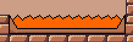
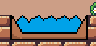
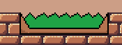
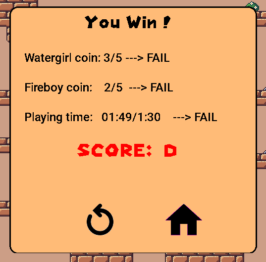
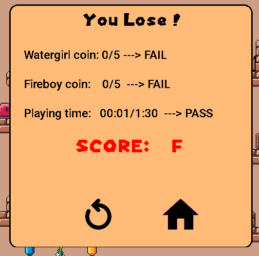

# Fireboy and Watergirl Adventure 
- Họ và tên: Bùi Trung Thanh 
- Lớp K68J, Trường Đại học Công Nghệ, Đại học Quốc gia Hà Nội (UET - VNU)

# Video Demo

# Table Of Content
- [**Fireboy and Watergirl**](#Fireboy-and-Watergirl-Adventure)
    - [**Video Demo**](#Video-demo)
    - [***Table Of Contents***](#Table-Of-Contents)
    - [**Giới thiệu game**](#Giới-thiệu-game)
    - [**Hướng dẫn chơi**](#Hướng-dẫn-chơi)
    - [**Các thành phần trong game**](#Các-thành-phần-trong-game)
    - [**Chiến thắng và thất bại**](#Chiến-thắng-và-thất-bại )
    - [**Về đồ họa**](#Về-đồ-họa)
    - [**Nguồn tham khảo**](#Nguồn-tham-khảo)
# Giới thiệu game 
- Fireboy and Watergirl Adventure là một trò chơi dành cho 2 người.
- Ngoài ra đây cũng có thể coi là một trò chơi phối hợp đơn giản. Bạn chỉ có thể qua màn một khi hai nhân vật cùng tới đích.
- Nhân vật chính trong game là Fireboy (chú bé lửa) và Watergirl (cô bé nước). Hai nhân vật này bị mắc kẹt trong một mê cung và họ chỉ có thể qua được khi có thể vượt qua những chướng ngại vật vô cùng khó khăn, cùng lúc đó cũng cần phải biết cách giúp đỡ, phối hợp, biết suy nghĩ để có thể qua cánh cửa để thoát ra khỏi bên ngoài. 

# Hướng dẫn chơi 
## Đối với người điều khiển Watergirl 
- Sử dụng phím `a` để di chuyển sang trái
- Sử dụng phím `d` để di chuyển sang phái 
- Sử dụng phím `w` để nhảy lên trên
- Sử dụng phím `q` để đặt bom
 
## Đối với người điều khiển Fireboy 
- Sử dụng phím `←` để di chuyển sang trái
- Sử dụng phím `→` để di chuyển sang phải
- Sử dụng phím `↑` để nhảy lên trên
- Sử dụng phím `l` để đặt bom
  
# Các thành phần trong game 
## Nhân vật chính
### Fireboy

- Bạn sẽ điều khiển nhân vật này để đi tới cửa của mình 
### Watergirl

- Một người chơi khác sẽ điều khiển nhân vật này, mục tiêu cuối cùng cũng là đi tới của của mình
- Hãy cố gắng phối hợp với nhau thật tốt, đừng bỏ quên bạn bè mà đi một mình nhé, vì chưa chắc một mình đã có thể qua cửa đâu 
## Các object tương tác với người chơi 
### Slime

- Slime sẽ liên tục di chuyển trong suốt quá trình chơi, việc của bạn là tránh đụng khỏi nó, nếu không nhân vật của bạn sẽ chết 
- Bạn sẽ thua cuộc khi chạm, dù chỉ một chút với Slime. 
### Barrier và button 

- Barrier là một thanh chắn có thể di chuyển được. Nếu nhân vật mà bạn của bạn điều khiển không đứng trên nút thì Barrier sẽ không di chuyển lên trên, bạn sẽ bị chắn và không thể đi qua được

- Như đã đề cập ở trên, khi nhân vật của bạn đứng trên button, thanh chắn Barrier của bạn sẽ di chuyển và bạn của bạn có thể đi qua được nó
### Bomb

- Bomb sẽ nổ sau 2 giây sau khi bắt đầu đặt.
- Tuy nhiên với mỗi một nhân vật, bạn chỉ có thể đặt lại một quả bom nữa chỉ khi đã qua 30 giây. 
### Thời gian chơi 

- Thời gian sẽ hiện ở chính giữa của màn hình chơi.
- Thời gian sẽ quyết định xem bạn ở đó được bao lâu. Hãy cố gắng nhanh nhất có thể vì càng về sau sẽ càng đuối sức đấy nhé. 
### Kim cương

- Hãy cố gắng ăn thật nhiều kim cương để khi qua cửa có thể dành được số điểm cao nhất.
- Nhớ rằng, bạn chỉ có thể ăn được khi ăn đúng với nhân vật của mình: Fireboy ăn kim cương vàng, Watergirl ăn kim cương xanh.
### Hồ dung nham 

- Fireboy có thể đi qua được hồ này mà không bị làm sao cả, trong khi đó Watergirl sẽ bốc hơi khi đắm mình trong đây.
### Hồ nước lạnh 

- Tương tự như vậy, Watergirl có thể đi qua được hồ nước, nhưng Fireboy thì không thể đi qua được.
### Hồ axit 

- Hồ axit vô cùng độc hại, cả hai nhân vật đều không thể đi qua được chỗ này.
- Nếu một nhân vật bị rơi xuống đây, cả hai đều sẽ bị thua cuộc.
# Chiến thắng và thất bại 
## Chiến thắng

- Có 4 cấp độ đánh giá khi bạn chiến thắng: `A`, `B`, `C`, `D`
- Bạn đạt được `A`, khi hoàn thành tất cả những điều kiện đặt ra của trò chơi
- Bạn đạt được `B`, khi không hoàn thành được 1 điều kiện.
- Bạn đạt được `C`, khi không hoàn thành 2 điều kiện.
- Bạn đạt được `D`, khi không hoàn thành một điều kiện nào

## Thất bại 

- Khi thất bại, dù bạn có `Pass` tất cả các điều kiện thì bạn vẫn chỉ nhận được `F` mà thôi.

- Tại đây bạn có thể bấm vào icon hình ngôi nhà để đi ra màn hình chính, bấm vào nút quay lại để chơi lại. Trong cả màn hình thắng và thua đều có 2 icon này để bạn lựa chọn.

# Kĩ thuật lập trình 
## Phát triển trên nền tảng
- IDE Code::Blocks 20.03
- Ngôn ngữ lập trình C++
- Thư viện SDL2 
- Extension của SDL2:
	- SDL_Image: Hỗ trợ xử lý hình ảnh 
	- SDL_Mixer: Hỗ trợ xử lý âm thanh
	- SDL_TTF: Hỗ trợ xử lý font

## Các kĩ thuật lập trình
- Vòng lặp, cấu trúc rẽ nhánh,...
- Con trỏ, vector, string,...
- Class
- Đọc viết file: ifstream
- Tách file quản lý code
- Kỹ thuật duyệt mảng, sinh số ngẫu nhiên
- Các kĩ thuật, syntax của SDL
- Kĩ thuật giải phóng bộ nhớ
- Kĩ thuật xử lý thời gian 

# Về đồ họa 
- Các texture trong game được lấy từ:
	- Map [itch.io](https://itch.io/)
	- Hình ảnh nhân vật [sanderfrenken.github.io](https://sanderfrenken.github.io/Universal-LPC-Spritesheet-Character-Generator/#?body=Body_color_light&head=Human_male_light)
	- Hình ảnh Slime [itch.io](https://itch.io/)
	- Hình ảnh Background: sưu tầm 
	- Âm thanh soundtrack và music sound [downloads.khinider.com](https://downloads.khinsider.com/game-soundtracks/album/fireboy-and-watergirl)
- Các hình ảnh còn lại là bản thân mình tự làm sao cho phù hợp với game
- Vẽ tile map bằng phần mềm: [Tiled](https://www.mapeditor.org/)

# Nguồn tham khảo 

- [Lazyfoo](https://lazyfoo.net/tutorials/SDL/)
- Kênh Youtube:[Phát Triển Phần Mềm 123A-Z](https://www.youtube.com/@PhatTrienPhanMem123AZ)